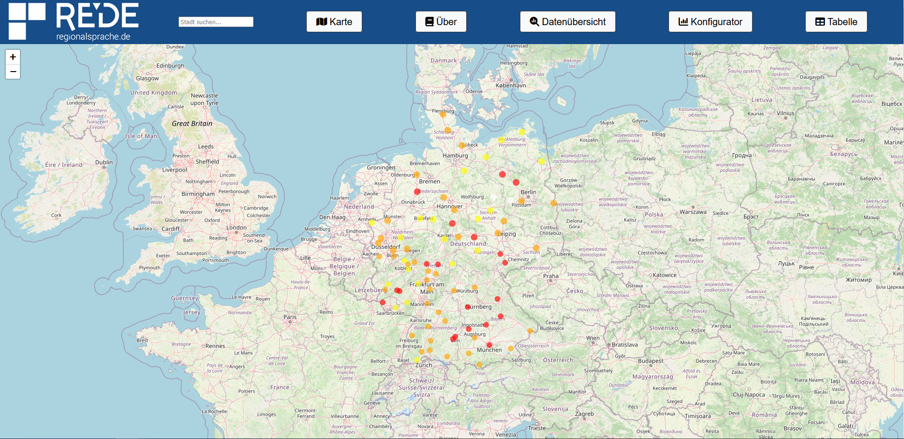
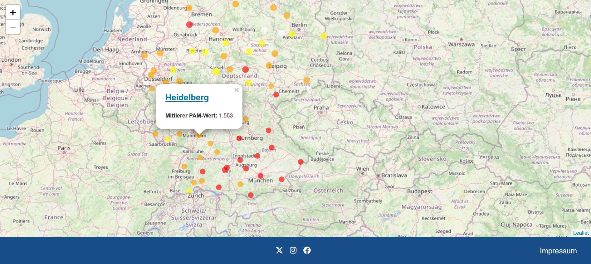
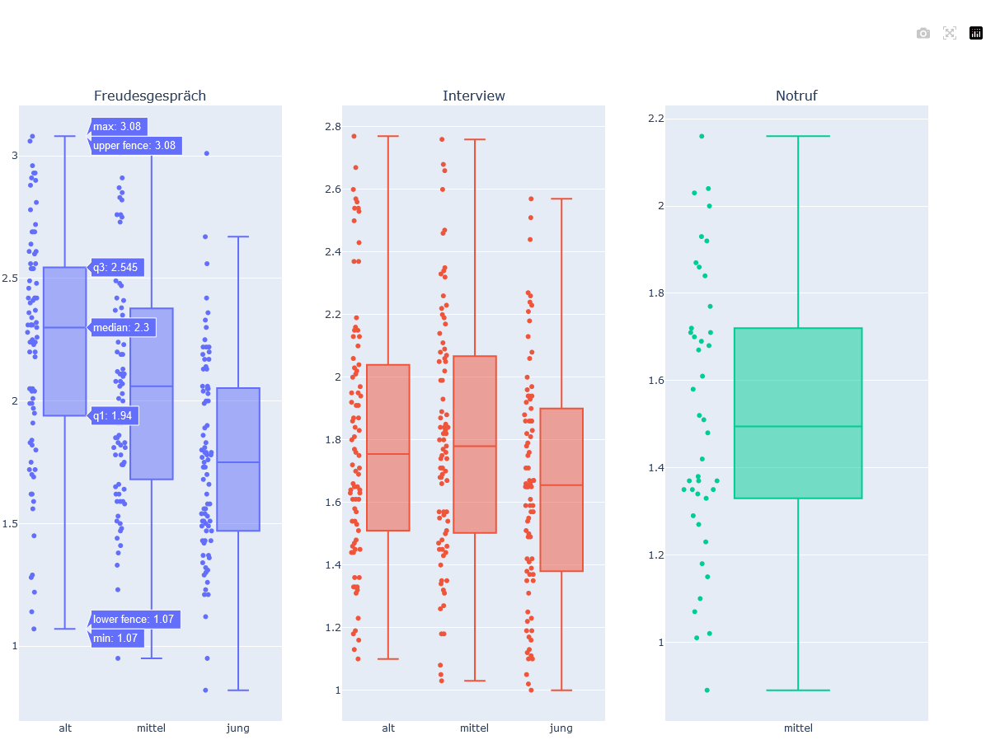
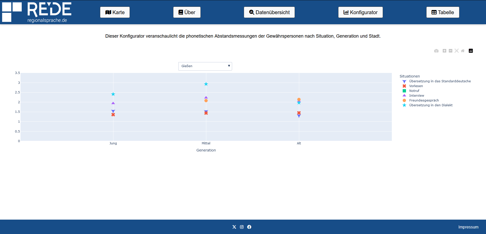

# Daten-Dashboard für das REDE-Projekt

Dieses Dashboard veranschaulicht den zur Verfügung gestellten Datensatz des [REDE-Projekts](https://www.regionalsprache.de/), in dem phonetische Abstandsmessungen in verschiedenen Regionen Deutschlands durchgeführt wurden. 

Das Backend umfasst einen multithreaded Python-Server, einige Skripte für die (statistische) Datenverarbeitung, sowie einige HTML-Dokumente, welche zur Laufzeit mit Daten formatiert werden. [^1]

Dieses Projekt nutzt die Open-Source-Bilbliotheken [Chart.js](https://www.chartjs.org/), [Plotly](https://plotly.com/python/) und [Leaflet](https://leafletjs.com/). 

[^1]: Grundsätzlich wäre ein Port auf moderne Framworks wie Flask + React sinnvoll. Zu Beginn dachte ich jedoch noch, dass dies aufgrund der eigentlichen Einfachheit nicht nötig sei und dann fehlte mir die Zeit, um das Projekt noch einmal zu überarbeiten. Leider funktioniert die Webseite deshalb nicht auf Smartphones. Auf Laptop und Monitoren unterschiedlicher Diagonalen fuktioniert das Dashboard einwandfrei.

# Übersicht und Benutzung

Für die Installation clonen sie das Repo und installieren sie die Abhängigkeiten:

<code>git clone [https://github.com/Nolram567/GRK2700](https://github.com/Nolram567/GRK2700.git)
cd GRK2700 && pip3 install -r requirements.txt
python3 server.py</code>

Als Docker-Container (eine funktionierende Installation von Docker wird vorausgesetzt):

<code>git clone [https://github.com/Nolram567/GRK2700](https://github.com/Nolram567/GRK2700.git)
cd GRK2700 && docker build -t dsa_dashboard:latest .
docker run -p 8000:8000 dsa_dashboard</code>

Das Data-Dashboard ist nun unter http://localhost:8000 erreichbar, oder unter der URL, die in der config.ini-Datei spezifiziert wurde.

Die Ordnerstruktur des Projekts sieht folgendermaßen aus:

Rede-Dashboard/

├── .gitignore           # Git-Ignore-Datei zum Ausschließen bestimmter Dateien

├── README.md            # Projektdokumentation und -beschreibung

├── requirements.txt     # Die Abhängigkeiten des Python-Projekts

├──config.ini               # Die Konfigurationsdatei, die die finale URL der Webseite enthalten sollte.

├── Dockerfile        

├── data/             # Die Rohdaten und die verarbeiteten Daten liegen in diesem Verzeichnis.

│   └── ...

├── public/              # In diesem Ordner liegen die HTML-Dateien, die Grafiken, das Favicon. [^2]

│   ├── ...         # Haupt-Server-Datei (oder wie auch immer sie heißt)

├── scripts/              # Dieser Ordner enthält einige Helferskripte: Einen Performance-Tester und einige Skripte

│   └── ...                       mit denen ich die plotly-Grafiken erzeugt habe.

├── Statistics.py    # Das Skript für die Datenverarbeitung. 

├── server.py        # Der Server.

Einige Eindrücke des UI:

